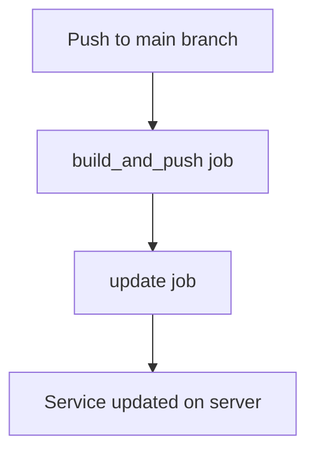

# 🚀 GitLab CI/CD Automated Docker Build & Deploy
<p align="center">
  
  <!-- Build & Deploy (GitHub Actions) -->
  <a href="https://github.com/onurozkn/gitlab-CI/actions/workflows/main.yml" title="GitHub Actions Build & Deploy">
    
    
  </a>
  &nbsp;&nbsp;
  <!-- GitLab Pipeline -->
  <a href="https://gitlab.com/onur_ozkan/gitlab-ci/-/pipelines" title="GitLab Pipeline">
    
    
  &nbsp;&nbsp;
  </a>
      <a href="https://github.com/onurozkn/gitlab-CI/commits/main" title="Last Commit">
    
    
  </a>
  <a href="https://gitlab.com/onur_ozkan/gitlab-CI/-/releases"></a>
</p>
> **Automated CI/CD pipeline for building, pushing, and deploying Docker images using GitLab and GitHub Actions.**

---

## ✨ Features

- 🔄 **Automatic Docker image build** on every push
- 🏷️ **Auto-incremented tags** for each pipeline (e.g., `dev_1`, `dev_2`, ...)
- 📦 **Pushes images to GitLab Container Registry**
- 🚢 **Updates Docker Swarm service** on your server
- 🔒 **Secure, fully automated workflow**

---

## 🛠️ How It Works

1. **build_and_push**: Builds the Docker image and pushes it to the GitLab Container Registry.
2. **update**: Updates the Docker Swarm service on your server with the new image.

---

## ⚙️ Key Variables in `.gitlab-ci.yml`

- `SERVICE_NAME`: Name of the Docker Swarm service to update
- `CI_PIPELINE_IID`: Auto-incremented unique number for each pipeline (used for tagging)
- `CI_REGISTRY_IMAGE`, `CI_REGISTRY_USER`, `CI_JOB_TOKEN`: Provided by GitLab
- `SSH_PRIVATE_KEY`, `DEPLOY_USER`, `DEPLOY_SERVER`: Set as CI/CD variables for server access

---

## 🚦 Example Pipeline Flow



---

## 🚧 GitHub Actions Integration

This project can also be integrated with GitHub Actions for code synchronization or additional automation. Example badge:

[](https://github.com/onurozkn/gitlab-CI/actions/workflows/main.yml)

- **How it works:**
  - On every push to `main`, GitHub Actions can push your code to GitLab, triggering the GitLab CI/CD pipeline.
  - You can add more badges for linting, tests, or deployment as needed.

---

## 🚀 Usage

1. **Set required variables in GitLab CI/CD > Settings > Variables:**
   - `SSH_PRIVATE_KEY`, `DEPLOY_USER`, `DEPLOY_SERVER`
2. **Ensure `.gitlab-ci.yml` is in your project root.**
3. **Push your code!**
   - Every push triggers the pipeline, builds the image, and updates your service.

---

## 🦊 GitLab Runner & Server Setup

> **To run your pipelines and deploy to your server, you need a GitLab Runner and some server/network setup.**

### 1. Install GitLab Runner

On your server (or a dedicated CI server):
```bash
# For Ubuntu/Debian
sudo apt-get install -y curl
curl -L https://packages.gitlab.com/install/repositories/runner/gitlab-runner/script.deb.sh | sudo bash
sudo apt-get install gitlab-runner

# For CentOS/RHEL
curl -L https://packages.gitlab.com/install/repositories/runner/gitlab-runner/script.rpm.sh | sudo bash
sudo yum install gitlab-runner
```

### 2. Register the Runner

```bash
sudo gitlab-runner register
```
- Enter your GitLab instance URL (e.g., `https://gitlab.com/`)
- Enter the registration token from **GitLab > Settings > CI/CD > Runners**
- Choose executor: `docker` (recommended) or `shell`
- Set tags (e.g., `60.33_docker_runner`)

### 3. Make Sure the Runner is Active
- Check in **GitLab > Settings > CI/CD > Runners** that your runner is online and tagged correctly.

### 4. Server/Network Considerations
- **If your server is not accessible from the internet:**
  - The runner must be able to reach both GitLab and your deployment target (e.g., via VPN or internal network).
  - If your server is firewalled, open the necessary ports for SSH and Docker communication.
- **If using Docker-in-Docker (`docker:dind`):**
  - Make sure the runner host has Docker installed and can run privileged containers if needed.

### 5. Private Registry/Firewall Notes
- If your server cannot access Docker Hub or GitLab Container Registry directly, consider using a proxy or mirror registry.
- For private GitLab projects, make sure your runner has access to the repository and registry.

---

## ❓ FAQ

- **Why are tags auto-incremented?**
  - Each pipeline gets a unique tag, so images never conflict and old versions are preserved.
- **Are old images deleted?**
  - No, old tags remain in the GitLab Container Registry.
- **Which image is used on the server?**
  - The latest tagged image is always deployed.
