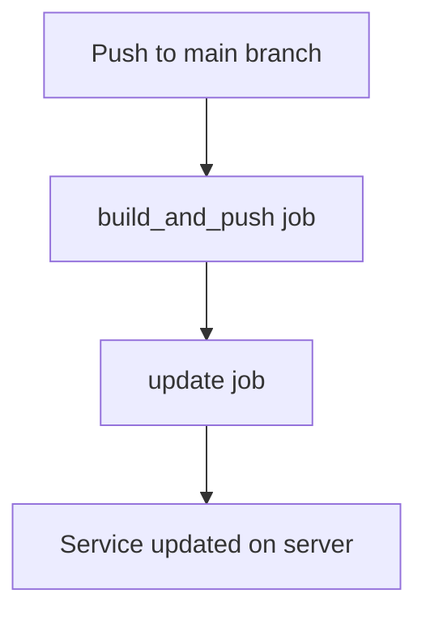

# GitLab CI/CD ile Otomatik Docker Build & Deploy

Bu proje, GitLab CI/CD kullanarak her push ile otomatik olarak Docker image'ı build eden, image'ı GitLab Container Registry'ye gönderen ve sunucuda Docker Swarm servisini güncelleyen bir otomasyon örneğidir.

## Özellikler
- Her push'ta otomatik artan tag ile Docker image build edilir (örn: `dev_1`, `dev_2`, ...).
- Image, GitLab Container Registry'ye push edilir.
- Sunucuda çalışan Docker Swarm servisi yeni image ile güncellenir.
- Tüm süreç tamamen otomatik ve güvenlidir.

## CI/CD Pipeline Akışı

1. **build_and_push**: Docker image'ı build eder ve GitLab Container Registry'ye push eder.
2. **update**: Sunucuda ilgili Docker servisini yeni image ile günceller.

## .gitlab-ci.yml'de Kullanılan Değişkenler
- `SERVICE_NAME`: Güncellenecek Docker Swarm servisinin adı
- `CI_PIPELINE_IID`: Her pipeline için otomatik artan benzersiz numara (tag için kullanılır)
- `CI_REGISTRY_IMAGE`, `CI_REGISTRY_USER`, `CI_JOB_TOKEN`: GitLab'ın otomatik sağladığı değişkenler
- `SSH_PRIVATE_KEY`, `DEPLOY_USER`, `DEPLOY_SERVER`: Sunucuya erişim için CI/CD Variables kısmında tanımlanmalı

## Actions (Pipeline) Görseli

Aşağıda, GitLab arayüzünde pipeline'ın (actions) nasıl göründüğüne dair örnek bir ekran görüntüsü bulabilirsin:

> GitLab'da **CI/CD > Pipelines** sekmesinden pipeline'ın durumunu ve adımlarını görsel olarak takip edebilirsin.

## Kullanım

1. **Gerekli değişkenleri GitLab CI/CD > Settings > Variables kısmında tanımla:**
   - `SSH_PRIVATE_KEY`, `DEPLOY_USER`, `DEPLOY_SERVER`
2. **Proje ana dizininde .gitlab-ci.yml dosyasını bulundur.**
3. **Kodunu pushla!**
   - Her push'ta pipeline otomatik çalışır, image build edilir ve sunucudaki servis güncellenir.

## Örnek Pipeline Akışı

## Sıkça Sorulanlar

- **Tag neden otomatik artıyor?**
  - Her pipeline için benzersiz bir tag oluşur, böylece image'lar çakışmaz ve eski versiyonlar korunur.
- **Eski image'lar silinir mi?**
  - Hayır, GitLab Container Registry'de eski tag'lar kalır.
- **Sunucuda hangi image kullanılıyor?**
  - Her güncellemede en son tag'lı image kullanılır.

---

Daha fazla bilgi için GitLab [CI/CD Pipeline Documentation](https://docs.gitlab.com/ee/ci/pipelines/) sayfasına göz atabilirsin.
