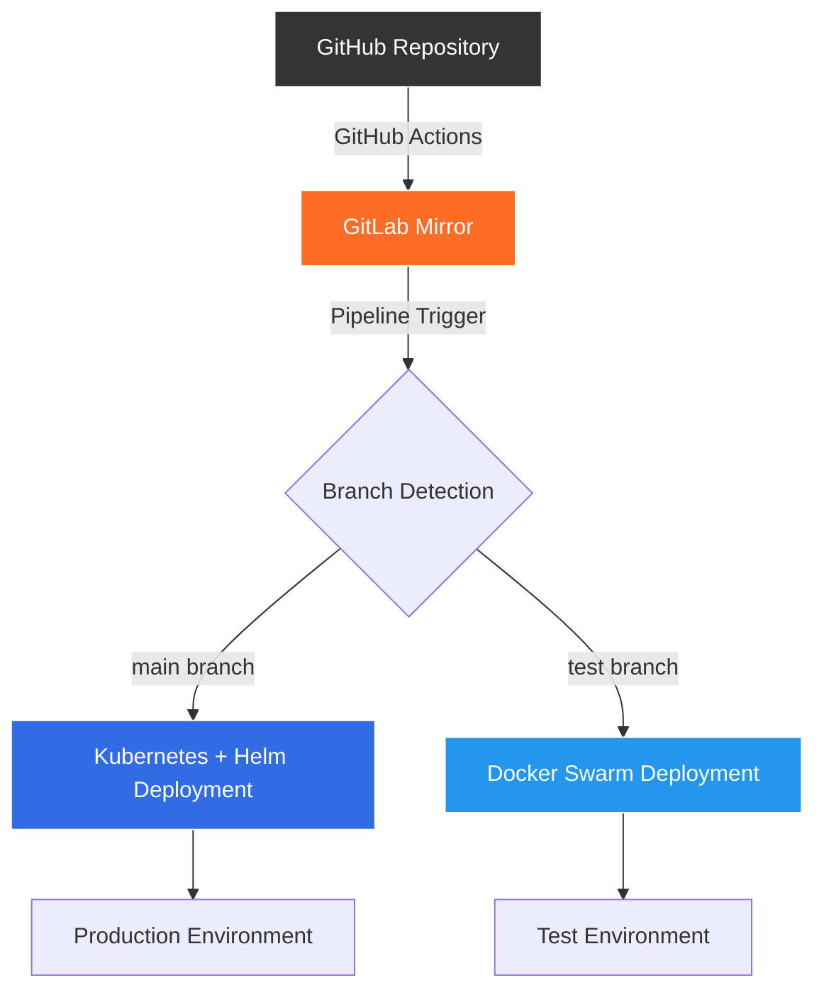

# Automated CI/CD Pipeline with GitLab & GitHub Integration

<p align="center">
  <a href="https://github.com/onurozkn/gitlab-CI/actions/workflows/main.yml">
    
  </a>
  <a href="https://gitlab.com/onur_ozkan/gitlab-ci/-/pipelines">
    
  </a>
  <a href="https://gitlab.com/onur_ozkan/gitlab-CI/-/releases">
    
  </a>
  
</p>

<p align="center">
  <strong>Comprehensive CI/CD pipeline orchestrating automated deployments across multiple environments using GitLab CI/CD, GitHub Actions, Kubernetes, and Docker Swarm.</strong>
</p>

---

## 🏗️ Architecture Overview

This project implements a sophisticated CI/CD workflow that automatically synchronizes code between GitHub and GitLab, triggering environment-specific deployments based on branch patterns:



---

## 🚀 Key Features

### 🔄 **Automated Cross-Platform Sync**
- GitHub Actions automatically mirrors code to GitLab
- Zero-configuration synchronization on every push
- Maintains commit history and branch structure

### 🏷️ **Smart Versioning System**
- Auto-incremented semantic tags (`dev_1`, `dev_2`, ...)
- Pipeline-based version management
- Immutable artifact storage

### 🎯 **Environment-Specific Deployments**
- **Production (`main`)**: Kubernetes cluster with Helm charts
- **Testing (`test`)**: Docker Swarm services
- Branch-based deployment strategy

### 🔐 **Enterprise Security**
- Secure credential management via GitLab CI/CD variables
- Registry authentication with job tokens
- Encrypted kubeconfig handling

---

## 📋 Pipeline Stages

### 1. **Build & Push** 
```yaml
build_and_push:
  - Builds Docker images with semantic versioning
  - Pushes to GitLab Container Registry
  - Generates deployment artifacts
```

### 2. **Environment Deployment**

#### **Test Environment** (`test` branch)
```yaml
update:
  - Deploys using Docker Swarm
  - Updates existing services
  - Rollback-ready configuration
```

#### **Production Environment** (`main` branch)
```yaml
k8s_deploy:
  - Deploys via Kubernetes + Helm
  - Namespace-isolated deployments
  - Health checks and rollout validation
```

### 3. **Release Management**
```yaml
release:
  - Creates Git tags
  - Generates release notes
  - Publishes to GitLab releases
```

---

## 🛠️ Technology Stack

| Component | Technology | Purpose |
|-----------|------------|---------|
| **Orchestration** | GitLab CI/CD | Pipeline automation & deployment |
| **Sync** | GitHub Actions | Cross-platform code synchronization |
| **Production** | Kubernetes + Helm | Container orchestration & package management |
| **Testing** | Docker Swarm | Lightweight container orchestration |
| **Registry** | GitLab Container Registry | Docker image storage |
| **Runner** | Self-hosted GitLab Runner | Execution environment |

---

## ⚙️ Configuration

### Required GitLab CI/CD Variables

| Variable | Description | Example |
|----------|-------------|---------|
| `KUBE_CONFIG` | Base64 encoded kubeconfig | `LS0tLS1CRUdJ...` |
| `SSH_PRIVATE_KEY` | Private key for server access | `-----BEGIN RSA...` |
| `DEPLOY_USER` | Deployment user | `deploy` |
| `DEPLOY_SERVER` | Target server hostname | `production.example.com` |

### Environment Variables

| Variable | Auto-Generated | Description |
|----------|----------------|-------------|
| `CI_PIPELINE_IID` | ✅ | Unique pipeline identifier |
| `CI_REGISTRY_IMAGE` | ✅ | Container registry URL |
| `CI_JOB_TOKEN` | ✅ | Pipeline authentication token |
| `SERVICE_NAME` | ❌ | Docker service name |
| `KUBE_NAMESPACE` | ❌ | Kubernetes namespace |

---

## 🚦 Deployment Flow

### **Test Environment Workflow**
1. Push to `test` branch
2. GitHub Actions syncs to GitLab
3. GitLab pipeline builds Docker image
4. Image pushed to registry with `dev_${CI_PIPELINE_IID}` tag
5. Docker Swarm service updated on target server
6. Health checks validate deployment

### **Production Environment Workflow**
1. Push/merge to `main` branch
2. GitHub Actions syncs to GitLab
3. GitLab pipeline builds Docker image
4. Helm chart deployment to Kubernetes cluster
5. Rolling update with zero-downtime
6. Release creation with semantic versioning

---

## 🏃‍♂️ GitLab Runner Setup

### Prerequisites
- Linux server with Docker installed
- Network access to GitLab.com and your deployment targets
- Sufficient resources for build operations

### Installation

```bash
# Install GitLab Runner
curl -L "https://packages.gitlab.com/install/repositories/runner/gitlab-runner/script.deb.sh" | sudo bash
sudo apt-get install gitlab-runner

# Register runner
sudo gitlab-runner register \
  --url "https://gitlab.com/" \
  --registration-token "<YOUR_REGISTRATION_TOKEN>" \
  --name "production-runner" \
  --tag-list "local" \
  --executor "shell" \
  --non-interactive

# Configure Docker permissions
sudo usermod -aG docker gitlab-runner
sudo systemctl restart gitlab-runner
```

### Verification
```bash
sudo gitlab-runner verify
sudo systemctl status gitlab-runner
```

---


## 📊 Monitoring & Observability

### Pipeline Metrics
- Build success rate and duration
- Deployment frequency and lead time
- Mean time to recovery (MTTR)

### Application Health
- Kubernetes pod status and resource usage
- Docker Swarm service health checks
- Registry storage utilization

---

## 🔧 Troubleshooting

### Common Issues

#### **Runner Offline**
```bash
sudo systemctl status gitlab-runner
sudo journalctl -u gitlab-runner -f
```

#### **Docker Permission Denied**
```bash
sudo usermod -aG docker gitlab-runner
sudo systemctl restart gitlab-runner
```

#### **Kubernetes Connection Issues**
```bash
kubectl config current-context
kubectl cluster-info
```

#### **Registry Authentication**
```bash
docker login registry.gitlab.com -u $CI_REGISTRY_USER -p $CI_JOB_TOKEN
```

---
**Note**: Remember to update credentials, server endpoints, and environment-specific configurations.

